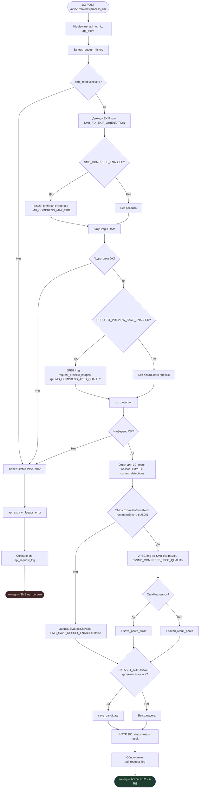

# Детекция контейнеров (веб + API для 1С)

Сервис на **FastAPI**: распознавание контейнеров (YOLO/OpenVINO), REST для интеграции с **1С**, журнал запросов, датасет YOLO, веб‑интерфейс и **PWA**.

## Содержание

- [Структура проекта](#структура-проекта)
- [Повторный process_link](#повторный-process_link)
- [Детекция и SMB](#что-происходит-при-детекции-и-когда-объектов-нет)
- [Полный процесс process_link](#полный-процесс-post-apiv1projectsprocess_link-1с--путь-к-файлу-на-smb)
- [Другие API](#другие-точки-входа-кратко)
- [Настройки](#ключевые-настройки-имена)
- [Конфигурация и секреты](#конфигурация-и-секреты)
- [Безопасность](#безопасность-и-продакшен)
- [Запуск](#запуск-пример)
- [Диагностика](#диагностика-инцидентов)
- [Разработка](#разработка-и-отладка)
- [База данных](#база-данных)
- [Известные ограничения](#известные-ограничения)

---

## Структура проекта

| Путь | Назначение |
|------|------------|
| `gateway/` | **Java-шлюз (Spring Boot)**: единая точка входа, проксирование `/api/**`, типизированный `/api/java/**` (см. [gateway/README.md](gateway/README.md)) |
| `docker-compose.yml` | Запуск всего стека: Java-шлюз (8080) + Python-сервис (8000) |
| `app/main.py` | FastAPI, SMB, детекция, датасет, журнал, настройки |
| `app/perf.py` | Сбор метрик `perf` в `extra_json` |
| `static/` | UI и PWA (`index.html`, `app.js`, `sw.js`) |
| `model_data/` | YOLO / OpenVINO модели (часть через Git LFS) |
| `db/sets.db` | SQLite: `api_request_log`, датасет, `request_history` |
| `data/` | runtime settings, кандидаты датасета, превью, экспорты |
| `.env` | Секреты и дефолты окружения (**не в git**, см. `.env.example`) |
| `scripts/` | Вспомогательные утилиты (например разбор классов `.pt`) |

---

## Повторный `process_link`

Типичный сценарий 1С: сначала файл ещё **не лежит** на SMB, позже мобильный клиент **выгружает** снимок и 1С снова шлёт тот же **`link_photo`**.

| Попытка | Файл на SMB | Ответ 1С | Запись на SMB | Строка в `api_request_log` |
|---------|-------------|----------|---------------|----------------------------|
| 1-я | нет | `status: false`, `error` | нет | `legacy_status: false`, `legacy_error` |
| 2-я | есть | `status: true`, `result` | сжатый JPEG (если `SMB_SAVE_RESULT_ENABLED`) | `legacy_status: true`, `smb_on_disk_status` |

Важно:

- Повтор **не блокируется** — нет «запрета» после первой ошибки.
- В журнале будут **две строки** с одним и тем же путём в `link_photo`; для расследования смотрите **последнюю успешную**.
- Если после успешной записи файл снова «большой» — его могли **перезаписать снаружи** (обменник/повторная выгрузка), а не наш второй вызов.

Рекомендация для 1С: вызывать `process_link` после появления файла на шаре или повторять запрос при `status: false` с ошибкой чтения SMB.

---

## Что происходит при детекции и когда объектов нет

Один и тот же сценарий **`process_link`** после успешного чтения файла и подготовки кадра:

| Этап | Есть детекции (≥ порога модели / попали в `result`) | Нет детекций (`count: 0`) |
|------|------------------------------------------------------|----------------------------|
| Ответ 1С | `status: true`, в **`result`** — массив прямоугольников + **`count`** | `status: true`, **`count: 0`**, без дополнительных записей прямоугольников |
| Журнал **`api_request_log`** | В **`extra_json`**: **`current_detections`** (список боксов), метрики, **`link_photo`** | То же: **`current_detections`** может быть пустым списком |
| Запись на SMB по **`link_photo`** | Перезапись файла **сжатым** JPEG (**длинная сторона ≤ SMB_COMPRESS_MAX_SIDE**, качество **`SMB_COMPRESS_JPEG_QUALITY`**, без рамок на изображении) | **То же правило**: файл на шаре всё равно перезаписывается подготовленным кадром с тем же качеством — от наличия объектов это **не зависит** |
| Датасет автосохранение | Если включено и есть объекты выше порога **`DATASET_SCORE_THRESHOLD`** — запись кандидата | Обычно **ничего** не добавляется в датасет (нет подходящих детекций) |

Исключение: если запрос **упал с ошибкой** (нет файла, SMB, модель, декодирование), то ответ **`status: false`**, на SMB **ничего не записывается**, исходный файл на шаре не меняют.

### Почему часть файлов на SMB могла остаться «как с оригинальным размером»

Раньше в коде по умолчанию было **`SMB_SAVE_RESULT_ENABLED=false`**, если не подхватывались **`data/runtime_settings.json`** и **`.env`** — перезапись на SMB **не выполнялась**, фото оставались как загрузил пользователь. Сейчас значение по умолчанию в приложении — **`SMB_SAVE_RESULT_ENABLED=true`**; полное отключение записи — только явно **`SMB_SAVE_RESULT_ENABLED=false`**.

Другие причины: ошибка записи на SMB (права, блокировка файла — в **`extra_json`** будет **`smb_on_disk_status":"error"`** и **`smb_save_error`**), запрос завершился ошибкой до шага сохранения (**`legacy_status":false`**), либо файл на шару **положили без вызова** нашего `process_link` (мобильный обменник пишет снимок сам — тогда в журнале **нет** строки с этим путём).

После обновления сервиса в **`extra_json`** для успешных `process_link` с непустым `link_photo` добавляются диагностические поля:

- **`smb_on_disk_status`**: `written` — сжатый JPEG записан; `disabled` — **`SMB_SAVE_RESULT_ENABLED=false`**; `no_path` — не удалось определить путь; `error` — исключение при записи (**`smb_save_error`**).
- При **`written`**: **`smb_written_jpeg_bytes`**, **`smb_written_detect_w`**, **`smb_written_detect_h`** — размер файла на диске и размеры кадра после пайплайна (до записи).

Проверка на сервере (пример для SQLite `db/sets.db`):

```sql
SELECT id, date, status_code,
       json_extract(extra_json, '$.link_photo') AS link,
       json_extract(extra_json, '$.smb_on_disk_status') AS smb_st,
       json_extract(extra_json, '$.smb_save_error') AS smb_err,
       json_extract(extra_json, '$.smb_written_jpeg_bytes') AS jpg_bytes
FROM api_request_log
WHERE path = '/api/v1/projects/process_link'
  AND extra_json LIKE '%Photo_4975_2_11052026_132046%'
ORDER BY date DESC LIMIT 5;
```

Если **строки нет** — этот файл нашим API не обрабатывался. Если **`smb_st` = `error`** — смотреть **`smb_err`**. Если **`disabled`** — в момент запроса запись на SMB была выключена.

---

## Полный процесс: `POST /api/v1/projects/process_link` (1С → путь к файлу на SMB)

Типичный сценарий: 1С передаёт JSON с путём к фото на сетевом ресурсе (UNC/SMB).

### 1. Приём запроса

1. Middleware создаёт запись запроса: **`api_log_id`**, пустой **`api_extra`** (позже заполняется).
2. В таблицу **`request_history`** пишется копия события (legacy).
3. Из тела запроса читаются поля вроде **`link_photo`** / **`path`** / **`url`**, **`login`**.

### 2. Чтение исходного файла по SMB

- **`smb_read(link)`**: подключение к **`SMB_SERVER`** с учётом **`SMB_USERNAME`**, **`SMB_PASSWORD`**, **`SMB_DOMAIN`**.
- Перебираются варианты UNC (пробелы, неразрывные пробелы и т.п.), пока файл не откроется.
- Если файла нет или ошибка SMB — исключение, переход к **ошибочному ответу** (см. ниже): **запись обратно на SMB не выполняется**.

### 3. Подготовка изображения в памяти (`prepare_image_before_detection`)

Порядок фиксированный:

1. **Декодирование** байтов в матрицу BGR (OpenCV).
2. Если **`SMB_FIX_EXIF_ORIENTATION=true`**: через PIL применяется **`exif_transpose`** (поворот по EXIF при наличии).
3. Если **`SMB_COMPRESS_ENABLED=true`**: **масштабирование с сохранением пропорций** так, чтобы **длинная сторона** не превышала **`SMB_COMPRESS_MAX_SIDE`** (по умолчанию **1024**). Алгоритм — `INTER_AREA`.

В журнал (**`extra_json`**) добавляются размеры: **`decoded_width/height`** (до ужатия) и **`detect_width/height`** (кадр, на котором считается детектор), **`storage_jpeg_quality`**.

Координаты боксов в ответе 1С и в журнале задаются **в системе координат этого подготовленного кадра** (после EXIF и ресайза), а не обязательно в пикселях оригинального файла на диске.

### 4. Локальное превью (опционально)

Если **`REQUEST_PREVIEW_SAVE_ENABLED=true`**, в **`data/request_preview_images/{api_log_id}.jpg`** сохраняется **тот же** подготовленный кадр в JPEG с качеством **`SMB_COMPRESS_JPEG_QUALITY`**.  
При **`REQUEST_PREVIEW_SAVE_ENABLED=false`** снимок **в момент запроса** на диск не пишется; при открытии **«Просмотр» в журнале** картинка по-прежнему подгружается с SMB по **`link_photo`** и кэшируется в `request_preview_images/{id}.jpg` для повторных открытий.

### 5. Распознавание (`run_detection`)

- Модель из **`MODEL_PATH`** (Ultralytics YOLO, в т.ч. экспорт OpenVINO).
- Порог уверенности по умолчанию — **`DETECT_SCORE_THRESHOLD`**, размер инференса — **`DETECT_IMAGE_SIZE`** (часто 1024).
- Результат: список детекций с **`xyxy`**, **`conf`**, **`class_id`**, **`name`**, плюс служебные поля (**`inference_ms`**, размеры кадра и т.д.).

### 6. Ответ 1С (успех)

- В legacy‑формате собирается **`result`**: первая запись — **`count`** и заглушка **`orientation`**, далее прямоугольники в стиле старого API (**`key`**, **`ratio`**, **`x0`…`y1`**).
- В **`api_extra`** и затем в **`api_request_log.extra_json`** попадают: полный JSON детекций (**`current_detections`**), метрики, **`link_photo`**, **`image_preprocess`**, при необходимости **`dataset_sample_id`**.

**Нулевой результат (0 объектов):** ответ остаётся успешным (`status: true`), просто **`count: 0`** и пустой список боксов.

### 7. Запись обратно на SMB (сжатый кадр **без рамок**)

По умолчанию (**`SMB_SAVE_RESULT_ENABLED=true`**):

- Целевой путь: приоритет у явных полей JSON (**`save_result_photo`**, **`link_photo_result`**, **`save_annotated_photo`**, **`result_photo_path`**), иначе — **тот же путь, что `link_photo`** (перезапись исходника).
- На SMB пишется подготовленный кадр **`img`** (после EXIF и ужатия по длинной стороне), **без рамок**, JPEG с качеством **`SMB_COMPRESS_JPEG_QUALITY`** (по умолчанию **50**).
- Боксы только в JSON ответа 1С и в **`extra_json`** журнала.

При **`SMB_SAVE_RESULT_ENABLED=false`** запись на SMB **полностью отключена** (ниже по тексту под «пропуском» это не имеется в виду — просто выключенная функция).

После успешной записи в ответе 1С может быть поле **`saved_result_photo`** (UNC/путь). При ошибке записи — **`save_photo_error`** (распознавание при этом уже выполнено).

**Нулевые детекции:** запись на SMB выполняется так же, как при наличии объектов (файл заменяется сжатым вариантом того же разрешения после пайплайна).

### 8. Опционально: автосохранение в датасет

Если **`DATASET_AUTOSAVE_ENABLED=true`**, часть кандидатов сохраняется в **`data/dataset_candidates`** (изображение + строки SQLite). Порог отбора — **`DATASET_SCORE_THRESHOLD`**.

### 9. Ошибка до завершения обработки

Любой сбой **до** конца блока успеха (SMB read, декодирование, детект и т.д.):

- **Файл на SMB не перезаписывается** (нет вызова успешной записи).
- Клиенту возвращается ответ с **`status: false`**, текст **`error`**, в **`api_extra`** — **`legacy_status: false`**, **`legacy_error`**.

### Блок-схема `process_link`

Диаграмма в синтаксисе [Mermaid](https://mermaid.js.org/) (рендерится в GitLab, GitHub и во многих редакторах Markdown).



**Легенда:** тёмно-красноватый конец — ошибка до завершения успешного блока; зелёный — успех. Узел **`U`** — перезапись на SMB при включённой записи (**по умолчанию включено**); **`V`** — только если **`SMB_SAVE_RESULT_ENABLED=false`**. Запись при **`U`** выполняется **и при 0 объектов**.

---

## Другие точки входа (кратко)

| Метод | Назначение |
|--------|------------|
| **`POST /api/v1/projects/process_photo`** | Тело: base64 фото (`photo`/`image`/`file`). Цепочка подготовки как выше → детект. Запись на SMB только если в JSON указан явный **`save_result_photo`** и т.п. или включён сохранённый режим там, где возможен путь (без **`link_photo`** автопуть по умолчанию не выводится из имени файла). |
| **`POST /api/predict`** | Загрузка файла multipart (ручная проверка в UI): подготовка кадра → детект. |
| **`GET /api/request-history`**, **`GET /api/request-log/{id}`** | Журнал и детали для мониторинга. |
| **`GET /api/settings`**, **`POST /api/settings`** | Текущие настройки и сохранение в **`data/runtime_settings.json`**. |

Переменные окружения задают **дефолты**; при наличии файла **`RUNTIME_SETTINGS_FILE`** значения из него **перекрывают** соответствующие ключи при старте (для ключей, которые там заданы).

---

## Ключевые настройки (имена)

| Параметр | Смысл |
|-----------|--------|
| `SMB_SERVER`, `SMB_USERNAME`, `SMB_PASSWORD`, `SMB_DOMAIN` | Доступ к SMB для чтения и записи. |
| `MODEL_PATH` | Каталог/модель YOLO или OpenVINO. По умолчанию: **`model_data/best_openvino_model`** (5 классов). Каталог OpenVINO должен называться `*_openvino_model`. |
| `DETECT_SCORE_THRESHOLD`, `DETECT_IMAGE_SIZE`, `DETECT_NMS_IOU` | Детекция. |
| `SMB_COMPRESS_ENABLED`, `SMB_COMPRESS_MAX_SIDE`, `SMB_COMPRESS_JPEG_QUALITY`, `SMB_FIX_EXIF_ORIENTATION` | Пайплайн перед детектом и качество JPEG при сохранении на диск/SMB/датасет. |
| `SMB_SAVE_RESULT_ENABLED` | Перезапись файла по **`link_photo`** сжатым JPEG (по умолчанию **включено**). |
| `REQUEST_PREVIEW_SAVE_ENABLED` | Локальные превью в `data/request_preview_images`. |
| `DATASET_AUTOSAVE_ENABLED`, `DATASET_SCORE_THRESHOLD`, `DATASET_AUTOSAVE_CLASS_IDS` | Кандидаты датасета: автосохранение только при наличии выбранных классов (детекция — по всем). |

---

## Модели и Git LFS

Активная модель по умолчанию — **`model_data/best_openvino_model`** (OpenVINO, `imgsz` 1024). Классы в модели (для справки; в ответ 1С уходит только числовой **`key`**):

| `key` | Класс в модели |
|------|----------------|
| 0 | container 1.1 |
| 1 | bunker 8 m |
| 2 | metal container 1.1 |
| 3 | container 1m3 |
| 4 | PET mesh lid |

Старая одноклассовая модель: `model_data/container.openvino/best_openvino_model` — переключение через `MODEL_PATH` или вкладку **Настройки**.

В репозитории тяжёлые **`*.bin`**, **`*.pt`** хранятся через **Git LFS**. После `git clone`:

```bash
git lfs install
git lfs pull
```

Иначе на диске останутся только pointer‑файлы, и OpenVINO выдаст ошибки вида «Incorrect weights in bin file».

---

## Конфигурация и секреты

1. Скопируйте шаблон: `cp .env.example .env` и заполните SMB/модель на сервере.
2. Файл **`.env` не коммитить** (добавлен в `.gitignore`). Если он уже попал в git: `git rm --cached .env` и ротация пароля SMB.
3. При старте приложение читает переменные окружения, затем **`data/runtime_settings.json`** перекрывает совпадающие ключи.
4. UI (**Настройки**) сохраняет изменения обратно в `runtime_settings.json` через `POST /api/settings`.

Порядок приоритета: **runtime JSON (после старта и из UI)** > **env при старте** > **дефолты в коде** `SETTINGS`.

---

## Безопасность и продакшен

Сервис по умолчанию **не требует аутентификации** на HTTP API. Любой клиент в сети с доступом к порту может вызывать распознавание, читать журнал, менять настройки и инициировать операции с датасетом/SMB от имени учётной записи **`SMB_USERNAME`**.

Минимальный чеклист для прода:

| Мера | Зачем |
|------|--------|
| Reverse-proxy (nginx) + TLS | Не светить uvicorn напрямую |
| Ограничение IP / VPN / API key на `/api/*` | Закрыть UI и админские методы |
| Отдельная SMB-учётка с ACL только на нужные шары | Ограничить чтение/перезапись |
| `uvicorn` на `127.0.0.1` за proxy | Не слушать `0.0.0.0` без firewall |
| Секреты через systemd `EnvironmentFile` или vault | Не хранить пароли в репозитории |
| Ротация `SMB_PASSWORD` при утечке `.env` | Учётка с правами записи на шару |

Запись на SMB по `link_photo` — **перезапись исходника** сжатым JPEG. Отключение: `SMB_SAVE_RESULT_ENABLED=false` (env или runtime settings).

---

## Запуск (пример)

```bash
cd /opt/garbage-detection-web
python3 -m venv .venv
. .venv/bin/activate
# Установите зависимости (FastAPI, uvicorn, ultralytics, opencv-python-headless, smbprotocol, pillow, numpy и т.д.)
cp -n .env.example .env   # затем отредактируйте .env
set -a && source .env && set +a
uvicorn app.main:app --host 127.0.0.1 --port 8000
```

Для доступа извне используйте reverse-proxy, а не публичный `--host 0.0.0.0` без защиты.

Проверка после старта: открыть `/index.html`, вкладка **Журналы** — появляются записи `process_link` / `predict`.

Статика с корня приложения; PWA: **`/manifest.webmanifest`**, **`/sw.js`** (регистрация в `static/app.js`).

---

## Веб‑интерфейс

Вкладки: **Распознавание**, **Датасет**, **Производительность**, **Настройки**, **Журналы**. На узких экранах — нижняя панель навигации. Превью в журнале при отключённом превью на сервере может не загружаться — это ожидаемо.

---

## Диагностика инцидентов

«В БД есть запрос, а файл на SMB не сжат» — сверяйте поля, а не только факт строки в журнале.

| Симптом | Что проверить |
|---------|----------------|
| Нет строки с путём фото | Файл не обрабатывался нашим API (загрузка только с телефона) |
| `legacy_status: false` | Ошибка до записи (нет файла, SMB, декод, модель) |
| `smb_on_disk_status: disabled` | В момент запроса `SMB_SAVE_RESULT_ENABLED=false` |
| `smb_on_disk_status: error` | `smb_save_error` — права, блокировка, путь |
| Две строки, первая ошибка, вторая OK | Нормальный повторный `process_link` после выгрузки |
| `status: true`, `count: 0`, файл сжат | Ожидаемо: запись на SMB не зависит от числа объектов |

Полезные эндпоинты: `GET /api/request-history`, `GET /api/request-log/{id}`, `GET /api/request-log/{id}/image`, `GET /api/metrics/recognition-speed`.

Очистка превью: `POST /api/request-log/cleanup-previews?days=14`.

---

## Разработка и отладка

- Основная логика — один файл `app/main.py`; при правках SMB/1С обновляйте **README**.
- Автотестов в репозитории пока нет — после изменений `process_link` проверяйте вручную: нет файла → повтор → 0 объектов → ошибка записи SMB.
- Синтаксис: `python3 -m py_compile app/main.py app/perf.py`.
- Не коммитить: `.env`, `db/*.db`, `data/runtime_settings.json`, каталоги `data/dataset_candidates`, `data/request_preview_images`.
- Git LFS: после clone выполнить `git lfs pull` перед проверкой OpenVINO.

При добавлении настройки: ключ в `SETTINGS`, чтение из env, опционально UI в `static/index.html` + `static/app.js`, строка в таблице README и `.env.example`.

---

## База данных

SQLite: **`db/sets.db`** — журнал API, датасет, заявки и т.д. Каталоги данных: **`data/`** (кандидаты, экспорты, при необходимости превью).

Таблицы (создаются в `init_db()` при старте):

| Таблица | Назначение |
|---------|------------|
| `api_request_log` | HTTP-журнал, `extra_json` с детекциями и SMB-диагностикой |
| `request_history` | Legacy-копия событий 1С (`process_link`) |
| `dataset_samples` / `dataset_annotations` | Кандидаты и разметка YOLO |
| `smb_ingest_log` | Зарезервирована под ingest (логика в коде может быть неполной) |

Отдельных миграций нет — схема меняется только через правки `init_db()` на новых установках.

---

## Известные ограничения

- **Нет auth** на API — см. [Безопасность](#безопасность-и-продакшен).
- Legacy-роуты 1С часто возвращают **HTTP 200** даже при `status: false` — мониторинг по коду ответа может врать; смотрите `legacy_status` в `extra_json`.
- `POST /api/settings` принимает произвольный JSON — в проде ограничивать доступ и планировать whitelist полей.
- Параллельный инференс в одном процессе может быть нестабилен — предпочтительно один worker или блокировка на `predict`.
- Middleware буферизует всё тело запроса — большие upload/base64 грузят память; нужны лимиты на proxy.
- Таблица `smb_ingest_log` и идемпотентность SMB-ingest могут быть не до конца реализованы — повторный ingest создаёт новые кандидаты.
